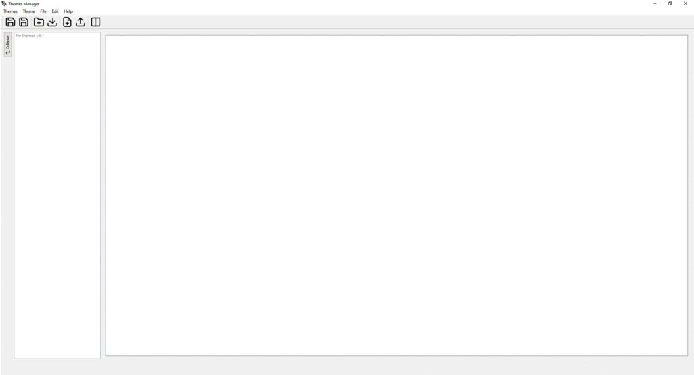
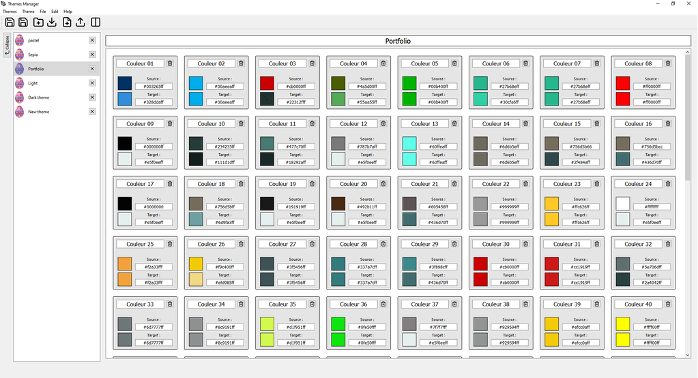
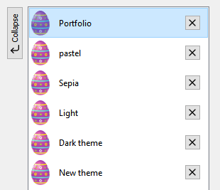
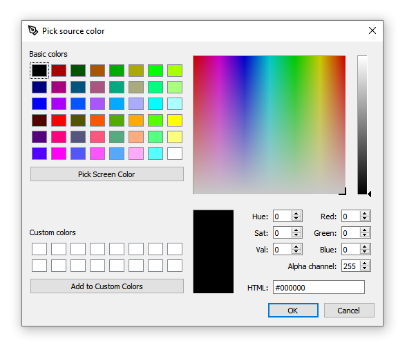
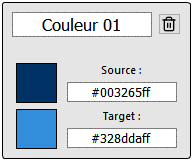

# Themes Manager

L'objectif de ce projet est de réaliser, via C++ et QtCreator, un logiciel permettant de gérer des thèmes de couleurs. Pour ce faire, un sujet ainsi qu'un cahier des charges nous sont fourni et nous avons alors établi un wireframe.

## Compilation

### Windows

Si vous évoluez sur un environnement Windows, je vous invite à consulter les releases sur ce repository qui contient un fichier exécutable.
Voir [ci-joint](https://doc.qt.io/qt-5/windows-deployment.html) pour la documentation sur la méthode suivie afin de générer cet exécutable.

### Linux

Malheureusement, la méthode utilisée précédemment pour Windows n'est pas compatible sur Linux. En effet, bien qu'il existe une méthode similaire, elle n'est en revanche pas développée par Qt et j'ai donc décidé de ne pas m'en servir. Cependant, étant donné que les jobs CI/CD ne posent pas de problèmes, j'imagine que la compilation depuis QtCreator ne devrait pas non plus en poser.

## Fonctionnalités développées

### Avec raccourcis :
- Sauvegarder les thèmes : Ctrl+Shift+S.
- Sauvegarder un thème : Ctrl+S.
- Créer un thème : Ctrl+Shift+N.
- Importer un thème : Ctrl+I.
- Appliquer un thème : Ctrl+E.
- Créer une paire de couleur : Ctrl+N.
- Réduire/Etendre le menu : Ctrl+M.

### Sans raccourcis :
- Changer le nom d'un thème.
- Changer le nom d'une paire couleur.
- Changer la couleur source d'une paire de couleur.
- Changer la couleur de destination d'une paire de couleur.
- Supprimer une paire de couleur d'un thème.
- Supprimer un thème de la liste des thèmes.
- Drag and drop des thèmes de la liste pour changer l'ordre.

- pouvoir sélectionner une couleur via un color picker

### Autres :
- Suppression d'une paire de couleur : une confirmation est demandée.
- Suppression d'un thème de la liste : vérification de l'état du thème (sauvegardé ou non) et suggère alors différentes actions.
- Fermeture du logiciel : une confirmation est demandée si des thèmes ne sont pas sauvegardés.
- Popup : des fenêtres d'informations quant à une action peuvent apparaître, en particulier lors de la sauvegarde, l'importation ou l'appliquation d'un thème.
- Input : lors de l'entrée de données par l'utilisateur, il est important de vérifier si les données sont conformes. Ainsi, à chaque modification apportée, la conformité est vérifiée puis la modification peut être enregistrée. Si cette dernière n'est pas conforme, l'input indique une erreur et la valeur n'est pas enregistrée.

Voici une démonstration sur l'input de la couleur source d'un paire de couleur.

## Fonctionnalités manquantes

### D'après le cahier des charges :
- Importer un fichier contenant des couleurs.
- Calculer le theme source d’un tel fichier.
- Charger tous les themes importés à une session précédente.
- Mettre a jour un thème d’après un lien internet.
- Modifier ce lien internet.
- L'icône d'un thème : actuellement, un thème possède une image par défaut au format .png (easteregg) qui est chargée mais n'est pas modifiable ni sauvegardable.

### D'après le wireframe :
- Search-bar dans la liste des thèmes.
- Menu récapitulatif du thème : le nom du thème est affiché au-dessus des paires de couleurs, sans l'image car elle figure déjà dans la liste des thèmes dans le menu de gauche.
- L'affichage par défaut du thème : les boutons sont de toutes manières accessibles depuis la tool-bar, j'ai donc préféré favoriser d'autres éléments du projet.

## Amélioration future
En plus des fonctionnalités manquantes citée ci-dessus, il pourrait être intéressant d'implémenter :
- des apparences différentes (en rapport avec notre projet !)
- un déploiement du logiciel
- des traductions
